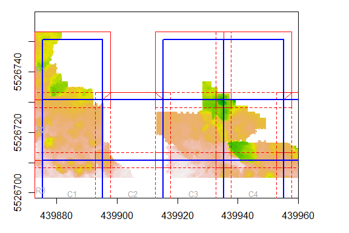

<!-- README.md is generated from README.Rmd. Please edit that file -->
TileManager: Tools for creating and detecting tiling schemes for geospatial datasets
------------------------------------------------------------------------------------

**Authors:** Andrew Plowright<br/> **License:** GPL 3

[](https://travis-ci.org/andrew-plowright/TileManager)

This package provides tools for working with tiled geospatial datasets.

#### Introduction

Use the `tileScheme` function to create a set of tiles from a Raster or Extent object.

``` r
library(TileManager)
#> TileManager - Please note that version 0.4.0 is NOT backwards compatible

data(CHMdemo)

ts <- tileScheme(CHMdemo, tiledim = c(30,30), buffer = 5)

plot(CHMdemo)
plot(ts, add = T)
```


Use the `removeEmpty` argument to drop tiles with no Raster values.

``` r
ts <- tileScheme(CHMdemo, tiledim = c(20,20), buffer = 2.5, removeEmpty = TRUE)

plot(CHMdemo)
plot(ts, add = T)
```


Other handy features:

-   The `origin` argument can be used to force the tile scheme to snap to a pair of coordinates.
-   The `bufferSpill` argument controls whether or not the buffers extent beyond the input's original extent.
-   By default, tile dimensions are in map units. Using the `cells` argument, they can be defined by a number of Raster cells.

#### The 'tileScheme' class

A 'tileScheme' object is composed of the following slots:

``` r
str(ts, 2)
#> Formal class 'tileScheme' [package "TileManager"] with 6 slots
#>   ..@ tiles :List of 32
#>   ..@ buffs :List of 32
#>   ..@ nbuffs:List of 32
#>   ..@ crs   :Formal class 'CRS' [package "sp"] with 1 slot
#>   ..@ buffer: num 2.5
#>   ..@ data  :'data.frame':   32 obs. of  3 variables:
```

-   Three lists of Polygons objects:
    -   `tiles`: the actual extents of the tiles
    -   `buffs`: the buffered tiles
    -   `nbuffs`: the non-overlapping buffers (see section below)
-   The `crs` slot, which stores the tile scheme's coordinate reference system.
-   A numeric `buffer` slot.
-   A data.frame in the `data` slot, which stores the row, column and name of each tile.

``` r
head(ts@data)
#>      row col tileName
#> R1C1   1   1     R1C1
#> R1C3   1   3     R1C3
#> R1C4   1   4     R1C4
#> R2C1   2   1     R2C1
#> R2C2   2   2     R2C2
#> R2C3   2   3     R2C3
```

#### Non-overlapping buffers

Non-overlapping buffers (often abbreviated to **nbuffs**) are useful for re-assembling tiled data. Essentially, they preserve buffers only where they *do not overlap onto neighboring tiles* (i.e.: along the edge of the tile scheme). This allows you to recombine tiles without worrying about overlapping areas *and* without losing any information along the data edges.

In the example below:

-   The **solid blue** is the tile
-   The **dashed red** is the buffer
-   The **solid red** is the non-overlapping buffer 

#### Methods

Some useful methods are provided for subsetting the tile scheme, or for converting it into other formats.

Get buffers as a SpatialPolygonsDataFrame:

``` r
ts[["buffs"]]
#> class       : SpatialPolygonsDataFrame 
#> features    : 32 
#> extent      : 439872.8, 440015.2, 5526636, 5526753  (xmin, xmax, ymin, ymax)
#> coord. ref. : +proj=utm +zone=11 +datum=WGS84 +units=m +no_defs +ellps=WGS84 +towgs84=0,0,0 
#> variables   : 3
#> names       : row, col, tileName 
#> min values  :   1,   1,     R1C1 
#> max values  :   6,   7,     R6C7
```

Subset a specific tile by name, number or row/col:

``` r
# By name
ts["R2C2"]
#> class     : tileScheme
#> extent    : 439895.25, 439915.25, 5526710.75, 5526730.75 (xmin, xmax, ymin, ymax)
#> CRS       : +proj=utm +zone=11 +datum=WGS84 +units=m +no_defs +ellps=WGS84 +towgs84=0,0,0
#> tiles     : 1
#> nrow/ncol : 1,1
#> buffer    : 2.5
#> variables : row, col, tileName

# By number
ts[7]
#> class     : tileScheme
#> extent    : 439935.25, 439955.25, 5526710.75, 5526730.75 (xmin, xmax, ymin, ymax)
#> CRS       : +proj=utm +zone=11 +datum=WGS84 +units=m +no_defs +ellps=WGS84 +towgs84=0,0,0
#> tiles     : 1
#> nrow/ncol : 1,1
#> buffer    : 2.5
#> variables : row, col, tileName

# By row/col
ts[2,3]
#> class     : tileScheme
#> extent    : 439915.25, 439935.25, 5526710.75, 5526730.75 (xmin, xmax, ymin, ymax)
#> CRS       : +proj=utm +zone=11 +datum=WGS84 +units=m +no_defs +ellps=WGS84 +towgs84=0,0,0
#> tiles     : 1
#> nrow/ncol : 1,1
#> buffer    : 2.5
#> variables : row, col, tileName
```

Subset entire rows or columns:

``` r
# One row
ts[4,]
#> class     : tileScheme
#> extent    : 439875.25, 439975.25, 5526670.75, 5526690.75 (xmin, xmax, ymin, ymax)
#> CRS       : +proj=utm +zone=11 +datum=WGS84 +units=m +no_defs +ellps=WGS84 +towgs84=0,0,0
#> tiles     : 5
#> nrow/ncol : 1,5
#> buffer    : 2.5
#> variables : row, col, tileName

# Multiple columns
ts[,2:3]
#> class     : tileScheme
#> extent    : 439895.25, 439935.25, 5526638, 5526750.75 (xmin, xmax, ymin, ymax)
#> CRS       : +proj=utm +zone=11 +datum=WGS84 +units=m +no_defs +ellps=WGS84 +towgs84=0,0,0
#> tiles     : 11
#> nrow/ncol : 6,2
#> buffer    : 2.5
#> variables : row, col, tileName
```

#### Saving and loading

The tile scheme can be saved as a single SHP file. In this case, `tiles`, `buffs` and `nbuffs` will all be merged into a single polygons dataset. Buffer information is saved to an accompanying XML file.

``` r
# Create tile scheme
ts <- tileScheme(CHMdemo, tiledim = c(30,30), buffer = 5)

# Save tile scheme
tileSave(ts, "C:/myfiles/tilescheme.shp")

# Load tile scheme
ts <- tileLoad("C:/myfiles/tilescheme.shp")
```

#### Tile detection

If you have a received a series of tiled raster files, the `tileDetector` function can even be used to detect the tile size and buffer size of the data and generate the associated `tileScheme`.
