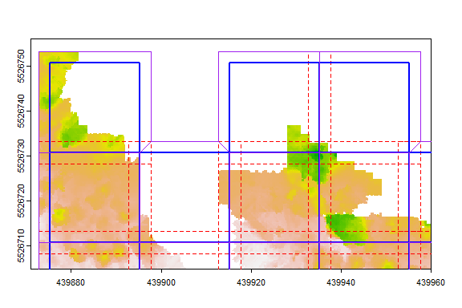

<!-- README.md is generated from README.Rmd. Please edit that file -->

## TileManager: Tools for creating and detecting tiling schemes for geospatial datasets

**Authors:** Andrew Plowright<br/> **License:** GPL 3

[](https://travis-ci.org/andrew-plowright/TileManager)

This package provides tools for working with tiled geospatial datasets.

# News

## 2024-03-08, v.1.0.0

The latest release of `TileManager` is a complete refactor of the old
library, which used the obsolete `raster` and `sp` packages. The new
version uses `terra` and `sf` instead. Although the structure of the
`tileScheme` class remains similar, any spatial outputs from this
library now use `sf` formats.

Furthermore, `tileScheme` objects are now saved to the Geopackage format
instead of SHP files.

# Introduction

Use the `tileScheme` function to create a set of tiles from a Raster or
Extent object.

``` r
library(TileManager)
library(terra)
#> Warning: package 'terra' was built under R version 4.3.2
#> terra 1.7.65

# Load a test raster
chm <- rast(system.file("ex/chm.tif", package="TileManager"))

# Generate a tile scheme
ts <- tileScheme(chm, dim = c(30,30), buffer = 5)

plot(chm)
plot(ts, add = T)
```

<!-- -->

Use the `remove_empty` argument to drop tiles with no Raster values.

``` r
ts <- tileScheme(chm, dim = c(20,20), buffer = 2.5, remove_empty = TRUE)

plot(chm)
plot(ts, add = T)
```

<!-- -->

Other handy features:

- The `origin` argument can be used to force the tile scheme to snap to
  a pair of coordinates.
- The `spill` argument controls whether or not the buffers extent beyond
  the input’s original extent.
- By default, tile dimensions are in map units. Using the `cells`
  argument, they can be defined by a number of Raster cells.

# Non-overlapping buffers

Non-overlapping buffers (often abbreviated to **nbuffs**) are useful for
re-assembling tiled data. Essentially, they preserve buffers only where
they *do not overlap onto neighboring tiles* (i.e.: along the edge of
the tile scheme). This allows you to recombine tiles without worrying
about overlapping areas *and* without losing any information along the
data edges.

In the example below:

- The **solid blue** is the tile
- The **dashed red** is the buffer
- The **solid purple** is the non-overlapping buffer
  <!-- -->

# Methods

Some useful methods are provided for subsetting the tile scheme, or for
converting it into other formats.

Get buffers as a `sf` object:

``` r
ts[["buffs"]]
#> Simple feature collection with 32 features and 3 fields
#> Geometry type: POLYGON
#> Dimension:     XY
#> Bounding box:  xmin: 439872.8 ymin: 5526636 xmax: 440015.2 ymax: 5526753
#> Projected CRS: WGS 84 / UTM zone 11N
#> First 10 features:
#>      row col tile_name                          buffs
#> R1C1   1   1      R1C1 POLYGON ((439872.8 5526728,...
#> R1C3   1   3      R1C3 POLYGON ((439912.8 5526728,...
#> R1C4   1   4      R1C4 POLYGON ((439932.8 5526728,...
#> R2C1   2   1      R2C1 POLYGON ((439872.8 5526708,...
#> R2C2   2   2      R2C2 POLYGON ((439892.8 5526708,...
#> R2C3   2   3      R2C3 POLYGON ((439912.8 5526708,...
#> R2C4   2   4      R2C4 POLYGON ((439932.8 5526708,...
#> R2C5   2   5      R2C5 POLYGON ((439952.8 5526708,...
#> R3C1   3   1      R3C1 POLYGON ((439872.8 5526688,...
#> R3C2   3   2      R3C2 POLYGON ((439892.8 5526688,...
```

Subset a specific tile by name, number or row/col:

``` r
# By name
ts["R2C2"]
#> class     : tileScheme
#> extent    : 439895.25, 5526710.75, 439915.25, 5526733.25 (xmin, ymin, xmax, ymax)
#> CRS       : WGS 84 / UTM zone 11N
#> tiles     : 1
#> nrow/ncol : 1,1
#> buffer    : 2.5

# By number
ts[7]
#> class     : tileScheme
#> extent    : 439935.25, 5526710.75, 439955.25, 5526730.75 (xmin, ymin, xmax, ymax)
#> CRS       : WGS 84 / UTM zone 11N
#> tiles     : 1
#> nrow/ncol : 1,1
#> buffer    : 2.5

# By row/col
ts[2,3]
#> class     : tileScheme
#> extent    : 439915.25, 5526710.75, 439935.25, 5526730.75 (xmin, ymin, xmax, ymax)
#> CRS       : WGS 84 / UTM zone 11N
#> tiles     : 1
#> nrow/ncol : 1,1
#> buffer    : 2.5
```

Subset entire rows or columns:

``` r
# One row
ts[4,]
#> class     : tileScheme
#> extent    : 439872.75, 5526670.75, 439977.75, 5526690.75 (xmin, ymin, xmax, ymax)
#> CRS       : WGS 84 / UTM zone 11N
#> tiles     : 5
#> nrow/ncol : 1,5
#> buffer    : 2.5

# Multiple columns
ts[,2:3]
#> class     : tileScheme
#> extent    : 439895.25, 5526635.5, 439935.25, 5526753.25 (xmin, ymin, xmax, ymax)
#> CRS       : WGS 84 / UTM zone 11N
#> tiles     : 11
#> nrow/ncol : 6,2
#> buffer    : 2.5
```

# Saving and loading

The tile scheme can be saved as a single Geopackage. In this case,
`tiles`, `buffs` and `nbuffs` will all be written to separate tables.
Other metadata (such as the buffer size) are written to a `metadata`
table.

``` r
# Create tile scheme
ts <- tileScheme(chm, dim = c(30,30), buffer = 5)

# Save tile scheme
tileSave(ts, "C:/myfiles/tilescheme.gpkg")

# Load tile scheme
ts <- tileLoad("C:/myfiles/tilescheme.gpkg")
```
